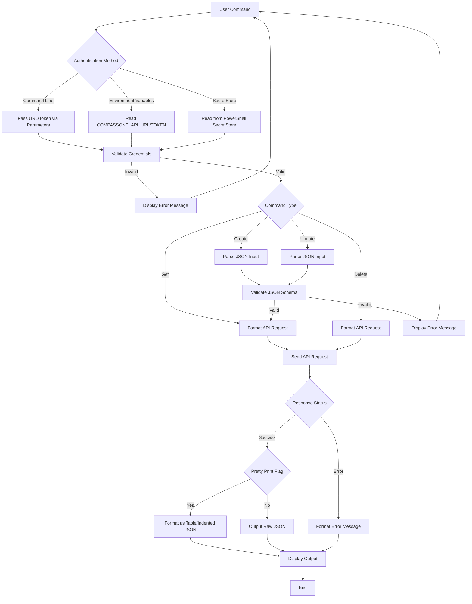
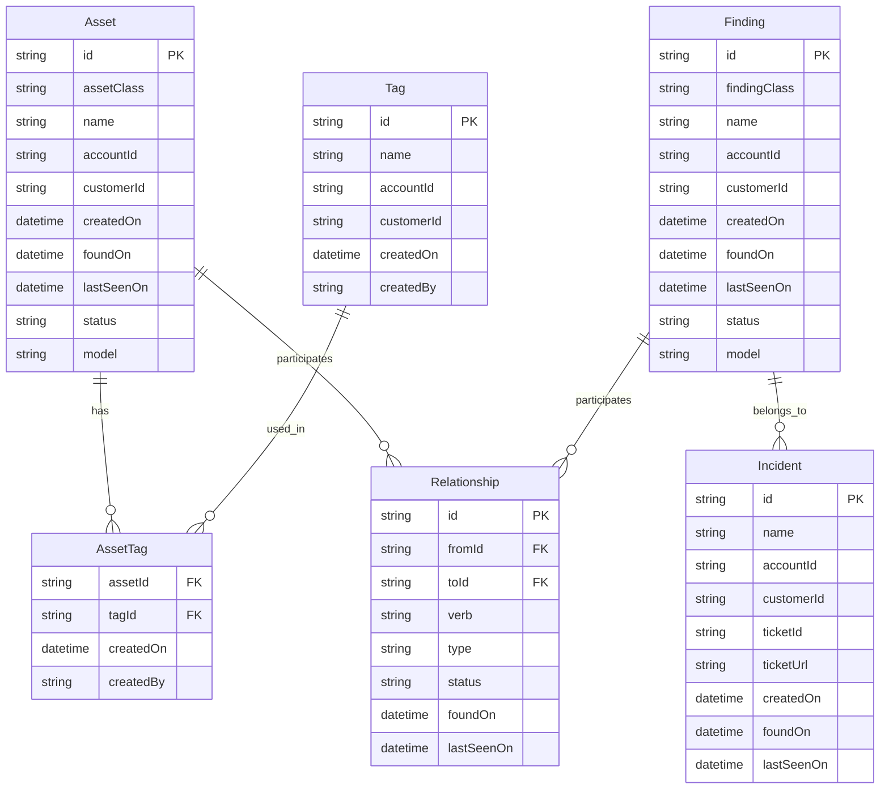
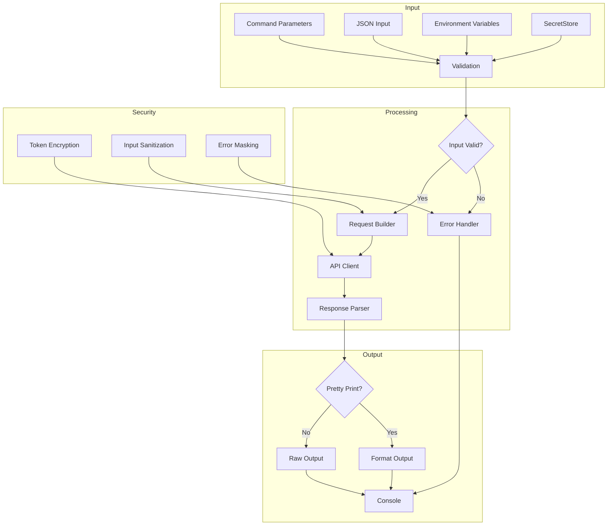
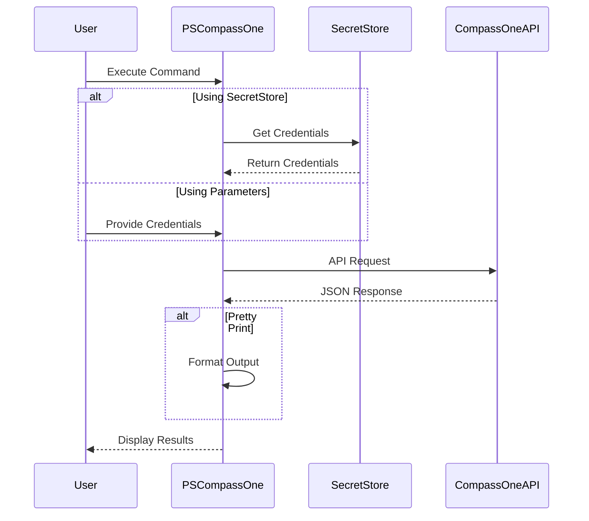

# Product Requirements Document (PRD)

## 1. INTRODUCTION

### 1.1 Purpose

This Product Requirements Document (PRD) specifies the requirements for developing a PowerShell Module called PSCompassOne that enables PowerShell users to interact with Blackpoint's CompassOne API. The document is intended for:

- Development team implementing the PowerShell module
- QA engineers testing the implementation
- Project stakeholders reviewing technical requirements
- Future maintainers of the PowerShell module

### 1.2 Scope

PSCompassOne will be a PowerShell module that provides native PowerShell commands to interact with the CompassOne API endpoints. The module will:

- Support all CRUD operations for assets, findings, incidents, relationships, and tags
- Follow PowerShell module best practices and naming conventions
- Handle authentication and configuration through multiple methods
- Support pagination and sorting for applicable API endpoints
- Provide formatted output options for API responses
- Include comprehensive help documentation
- Support error handling and user feedback
- Enable JSON input for create/update operations

Key benefits include:

- Native PowerShell experience for CompassOne API interactions
- Simplified authentication and configuration management
- Consistent command structure following PowerShell conventions
- Reduced development effort for PowerShell users integrating with CompassOne
- Enhanced readability of API responses through formatting options

The module will be distributed through standard PowerShell package channels and maintained as an open-source project.

## 2. PRODUCT DESCRIPTION

### 2.1 Product Perspective

PSCompassOne is a PowerShell module that integrates with Blackpoint's CompassOne API to provide native PowerShell command-line access to the platform's functionality. The module operates as a standalone component within the larger CompassOne ecosystem, serving as one of several API integration options alongside existing Node.js and Python SDKs and CLIs.

The module interfaces directly with the CompassOne REST API endpoints while adhering to PowerShell conventions and best practices. It handles authentication, request formatting, and response processing to provide a seamless PowerShell experience.

Key integration points include:

- CompassOne REST API endpoints
- PowerShell module ecosystem
- Microsoft.PowerShell.SecretStore for credential management
- PowerShell formatting system for output display

### 2.2 Product Functions

The PSCompassOne module provides the following core functions:

- Authentication and Configuration Management

  - Multiple authentication methods (command-line, environment variables, SecretStore)
  - Configuration persistence options
  - API endpoint URL management

- Asset Management

- Create, read, update, delete (CRUD) operations for assets

- Supports creation of specific Asset classes (Container, Device, Framework, etc.)

- Asset tag management (replace tags)

- Asset relationship management

- Finding Management

  - CRUD operations for findings (Alerts, Events)
  - Finding classification and status management
  - Finding relationship management

- Incident Management

  - CRUD operations for incidents
  - Link incidents to alerts
  - Track incident status and updates
  - Create, delete, and get notes for an incident

- Relationship Management

  - Create and manage relationships between entities
  - Query related entities
  - Relationship type and status management

- Tag Management

  - Create and manage tags
  - Assign tags to assets
  - Tag-based filtering and organization

### 2.3 User Characteristics

Primary users of PSCompassOne include:

1. Security Operations Teams

   - Expertise: Advanced PowerShell knowledge, security operations experience
   - Use Case: Automation of security monitoring and response tasks

2. IT System Administrators

   - Expertise: Intermediate to advanced PowerShell skills
   - Use Case: Asset management and security posture monitoring

3. DevOps Engineers

   - Expertise: Advanced scripting and automation skills
   - Use Case: Integration of CompassOne into deployment pipelines

4. Security Analysts

   - Expertise: Basic to intermediate PowerShell knowledge
   - Use Case: Security incident investigation and management

### 2.4 Constraints

1. Technical Constraints

   - Must be compatible with PowerShell 5.1 and PowerShell Core 7.x
   - Must follow PowerShell module development guidelines
   - Must maintain backward compatibility with API versions
   - Must validate object properties
   - Must validate sorting fields
   - Must validate paging parameters (positive, non-zero values)
   - Must handle rate limiting and API quotas

2. Security Constraints

   - Must securely handle authentication tokens
   - Must support secure credential storage
   - Must validate input to prevent injection attacks
   - Must handle sensitive data appropriately

3. Performance Constraints

   - Must handle large datasets efficiently
   - Must implement proper pagination
   - Must maintain reasonable response times
   - Must manage memory usage effectively

4. Documentation Constraints

   - Must provide comprehensive PowerShell help documentation
   - Must maintain up-to-date examples and usage guides
   - Must document all command parameters and options

### 2.5 Assumptions and Dependencies

Assumptions:

- Users have basic PowerShell knowledge
- CompassOne API maintains backward compatibility
- Users have valid CompassOne API credentials
- Network access to CompassOne API endpoints is available

Dependencies:

- PowerShell 5.1 or PowerShell Core 7.x
- Microsoft.PowerShell.SecretStore module
- Active CompassOne subscription
- Internet connectivity
- Valid API authentication credentials
- Sufficient API rate limits and quotas

## 3. PROCESS FLOWCHART



### 4. FUNCTIONAL REQUIREMENTS

#### 4.1 Authentication and Configuration Management

| ID | Description | Priority |
| --- | --- | --- |
| AUTH-1 | Support command-line authentication via -u/--url and -t/--token parameters | HIGH |
| AUTH-2 | Support environment variable authentication via COMPASSONE_API_URL and COMPASSONE_API_TOKEN | HIGH |
| AUTH-3 | Support Microsoft.PowerShell.SecretStore for persistent credential storage | MEDIUM |
| AUTH-4 | Validate authentication credentials before API operations | HIGH |
| AUTH-5 | Handle authentication errors with clear error messages | HIGH |

#### 4.2 Asset Management

| ID | Description | Priority |
| --- | --- | --- |
| ASSET-1 | Create assets with JSON input validation for all asset classes | HIGH |
| ASSET-2 | Retrieve single asset by ID with optional pretty-print formatting | HIGH |
| ASSET-3 | List assets with pagination, sorting, and filtering support | HIGH |
| ASSET-4 | Update assets with partial updates and validation | HIGH |
| ASSET-5 | Delete assets with soft-delete support | HIGH |
| ASSET-6 | Manage asset tags through dedicated commands | MEDIUM |
| ASSET-7 | Support all asset classes: Container, Device, Framework, etc. | HIGH |

#### 4.3 Finding Management

| ID | Description | Priority |
| --- | --- | --- |
| FIND-1 | Create findings (Alerts, Events) with JSON validation | HIGH |
| FIND-2 | Retrieve single finding by ID with formatting options | HIGH |
| FIND-3 | List findings with pagination and sorting support | HIGH |
| FIND-4 | Update findings with validation | HIGH |
| FIND-5 | Delete findings with proper cleanup | HIGH |
| FIND-6 | Support finding-specific fields and operations | MEDIUM |

#### 4.4 Incident Management

| ID | Description | Priority |
| --- | --- | --- |
| INC-1 | Create incidents with alert associations | HIGH |
| INC-2 | Retrieve incident details with formatting | HIGH |
| INC-3 | List incidents with search and pagination | HIGH |
| INC-4 | Update incident status and details | HIGH |
| INC-5 | Delete incidents with proper cleanup | HIGH |
| INC-6 | Link alerts to existing incidents | MEDIUM |

#### 4.5 Relationship Management

| ID | Description | Priority |
| --- | --- | --- |
| REL-1 | Create relationships between entities | HIGH |
| REL-2 | Retrieve relationship details | HIGH |
| REL-3 | Update relationship properties | HIGH |
| REL-4 | Delete relationships | HIGH |
| REL-5 | List related entities for assets | MEDIUM |
| REL-6 | List related entities for findings | MEDIUM |

#### 4.6 Tag Management

| ID | Description | Priority |
| --- | --- | --- |
| TAG-1 | Create tags with proper validation | HIGH |
| TAG-2 | Retrieve tag details | HIGH |
| TAG-3 | List tags with search and pagination | HIGH |
| TAG-4 | Update tag properties | HIGH |
| TAG-5 | Delete tags | HIGH |
| TAG-6 | Assign tags to assets | HIGH |

#### 4.7 Output Formatting

| ID | Description | Priority |
| --- | --- | --- |
| OUT-1 | Support pretty-print flag for formatted output | HIGH |
| OUT-2 | Format array responses as tables | HIGH |
| OUT-3 | Format object responses with indentation | HIGH |
| OUT-4 | Support raw JSON output | HIGH |
| OUT-5 | Handle empty responses appropriately | MEDIUM |

#### 4.8 Error Handling

| ID | Description | Priority |
| --- | --- | --- |
| ERR-1 | Provide clear error messages for API errors | HIGH |
| ERR-2 | Handle rate limiting and quotas | HIGH |
| ERR-3 | Validate input parameters | HIGH |
| ERR-4 | Handle network connectivity issues | HIGH |
| ERR-5 | Log errors appropriately | MEDIUM |

#### 4.9 Help and Documentation

| ID | Description | Priority |
| --- | --- | --- |
| HELP-1 | Implement Get-Help support for all commands | HIGH |
| HELP-2 | Provide examples in help documentation | HIGH |
| HELP-3 | Include parameter descriptions | HIGH |
| HELP-4 | Document error scenarios | MEDIUM |
| HELP-5 | Maintain up-to-date command syntax help | HIGH |

### 5. NON-FUNCTIONAL REQUIREMENTS

#### 5.1 Performance Requirements

| ID | Requirement | Priority |
| --- | --- | --- |
| PERF-1 | Command execution response time must be under 2 seconds for single-item operations | HIGH |
| PERF-2 | Batch operations must process at least 50 items per second | MEDIUM |
| PERF-3 | Memory usage must not exceed 100MB during normal operation | HIGH |
| PERF-4 | Module startup time must be under 1 second | MEDIUM |
| PERF-5 | Support concurrent execution of multiple commands | HIGH |

#### 5.2 Safety Requirements

| ID | Requirement | Priority |
| --- | --- | --- |
| SAFE-1 | Implement automatic rollback for failed operations | HIGH |
| SAFE-2 | Provide data validation before API submissions | HIGH |
| SAFE-3 | Implement proper error handling for all operations | HIGH |
| SAFE-4 | Log all critical operations and errors | HIGH |
| SAFE-5 | Prevent destructive operations without confirmation | MEDIUM |

#### 5.3 Security Requirements

| ID | Requirement | Priority |
| --- | --- | --- |
| SEC-1 | Store API credentials securely using Microsoft.PowerShell.SecretStore | HIGH |
| SEC-2 | Encrypt all sensitive data in transit | HIGH |
| SEC-3 | Implement token validation before API calls | HIGH |
| SEC-4 | Clear sensitive data from memory after use | HIGH |
| SEC-5 | Support HTTPS connections only | HIGH |
| SEC-6 | Validate all input parameters against injection attacks | HIGH |

#### 5.4 Quality Requirements

##### 5.4.1 Availability

| ID | Requirement | Priority |
| --- | --- | --- |
| AVAIL-1 | Module must be operational 99.9% of execution time | HIGH |
| AVAIL-2 | Graceful degradation during API service interruptions | MEDIUM |
| AVAIL-3 | Support offline help documentation | MEDIUM |

##### 5.4.2 Maintainability

| ID | Requirement | Priority |
| --- | --- | --- |
| MAINT-1 | Follow PowerShell module development best practices | HIGH |
| MAINT-2 | Maintain comprehensive inline code documentation | HIGH |
| MAINT-3 | Implement modular design for easy updates | HIGH |
| MAINT-4 | Support version compatibility tracking | MEDIUM |

##### 5.4.3 Usability

| ID | Requirement | Priority |
| --- | --- | --- |
| USE-1 | Provide consistent command naming conventions | HIGH |
| USE-2 | Implement comprehensive Get-Help documentation | HIGH |
| USE-3 | Support tab completion for commands and parameters | HIGH |
| USE-4 | Provide clear error messages and resolution steps | HIGH |

##### 5.4.4 Scalability

| ID | Requirement | Priority |
| --- | --- | --- |
| SCAL-1 | Support handling of large datasets through pagination | HIGH |
| SCAL-2 | Efficient memory management for large operations | HIGH |
| SCAL-3 | Support multiple concurrent API connections | MEDIUM |

##### 5.4.5 Reliability

| ID | Requirement | Priority |
| --- | --- | --- |
| REL-1 | Implement retry logic for failed API calls | HIGH |
| REL-2 | Maintain data consistency during operations | HIGH |
| REL-3 | Handle network interruptions gracefully | HIGH |
| REL-4 | Validate API responses for completeness | MEDIUM |

#### 5.5 Compliance Requirements

| ID | Requirement | Priority |
| --- | --- | --- |
| COMP-1 | Adhere to PowerShell Gallery publishing requirements | HIGH |
| COMP-2 | Comply with PowerShell module signing requirements | HIGH |
| COMP-3 | Follow Microsoft naming conventions for modules | HIGH |
| COMP-4 | Maintain compatibility with PowerShell 5.1 and 7.x | HIGH |
| COMP-5 | Support standard PowerShell logging mechanisms | MEDIUM |
| COMP-6 | Implement proper error code returns | HIGH |

### 6. DATA REQUIREMENTS

#### 6.1 Data Models

The PSCompassOne module interacts with the following core data entities:



#### 6.2 Data Storage

##### 6.2.1 Local Storage

- Configuration data stored in Microsoft.PowerShell.SecretStore
- Temporary response caching in memory during module execution
- Optional JSON file storage for request/response templates

##### 6.2.2 Data Retention

- Authentication tokens stored only for current session unless persisted in SecretStore
- Response data cached only during command execution
- No local storage of API response data beyond command execution

##### 6.2.3 Backup and Recovery

- Configuration backup through SecretStore native capabilities
- Command history maintained through PowerShell session logging
- No additional backup requirements as module is stateless

#### 6.3 Data Processing



#### 6.4 Data Security

##### 6.4.1 Authentication Data

- API tokens encrypted at rest when stored in SecretStore
- Tokens masked in error messages and logs
- Environment variables accessed securely through PowerShell

##### 6.4.2 Request/Response Security

- All API communication over HTTPS
- Request headers sanitized before logging
- Sensitive data masked in debug output
- JSON input validated against schemas

##### 6.4.3 Data Access Controls

- Module functions enforce proper authentication
- API responses filtered based on user permissions
- Error messages sanitized to prevent information disclosure

#### 6.5 Data Validation

| Data Type | Validation Rules |
| --- | --- |
| API URL | Valid HTTPS URL format |
| API Token | Non-empty string, proper length |
| JSON Input | Schema validation against API specs |
| Asset IDs | UUID format validation |
| Date/Time | ISO 8601 format validation |
| Pagination | Positive integers, max page size |
| Sort Fields | Whitelist of allowed fields |
| Tag Names | Alphanumeric, max length |

#### 6.6 Data Transformation

| Source Format | Target Format | Transformation Rule |
| --- | --- | --- |
| API JSON | PowerShell Objects | Automatic deserialization |
| PowerShell Objects | API JSON | Serialization with schema validation |
| Array Responses | PowerShell Tables | Format-Table with defined properties |
| Object Responses | Indented Text | Format-List with proper spacing |
| Date/Time Input | ISO 8601 | Automatic conversion |
| Error Responses | Error Records | PowerShell error record creation |

### 7. EXTERNAL INTERFACES

#### 7.1 User Interfaces

The PSCompassOne module follows standard PowerShell command-line interface conventions:

| Interface Element | Description |
| --- | --- |
| Command Syntax | Follows PowerShell verb-noun naming (e.g., Get-Asset, New-Finding) |
| Parameter Format | Uses standard PowerShell parameter notation (-Parameter or --Parameter) |
| Help System | Integrates with Get-Help command for documentation |
| Output Format | Supports table and list views through Format-Table and Format-List |
| Error Display | Uses standard PowerShell error stream and formatting |

Example command interface pattern:

```powershell
Verb-CraftNoun [-Parameter] <type> [-Optional] [[-Switch]] [-PrettyPrint]
```

#### 7.2 Software Interfaces

##### 7.2.1 CompassOne API Integration

| Component | Specification |
| --- | --- |
| Protocol | HTTPS REST API |
| Authentication | API Key via header |
| Content Type | application/json |
| API Version | v1 |
| Rate Limiting | Handled through API response codes |

##### 7.2.2 PowerShell Integration

| Component | Specification |
| --- | --- |
| PowerShell Version | 5.1 and 7.x compatible |
| Module Type | Binary/Script hybrid module |
| Dependencies | Microsoft.PowerShell.SecretStore |
| Package Format | PowerShell Gallery compatible |

##### 7.2.3 SecretStore Integration

| Component | Specification |
| --- | --- |
| Store Type | Microsoft.PowerShell.SecretStore |
| Vault Name | PSCompassOne |
| Secret Types | API URL, API Token |
| Encryption | Platform-native secure storage |

#### 7.3 Communication Interfaces

##### 7.3.1 Network Communication

| Interface | Specification |
| --- | --- |
| Protocol | HTTPS (TLS 1.2+) |
| Port | 443 |
| DNS Resolution | Required for API endpoints |
| Proxy Support | System proxy configuration |

##### 7.3.2 Data Exchange Formats

| Format | Usage |
| --- | --- |
| Request Headers | Content-Type: application/json, Accept: application/json, key: {token} |
| Request Body | JSON with schema validation |
| Response Format | JSON with optional pretty printing |
| Error Format | Standard PowerShell error objects |

##### 7.3.3 API Communication Patterns



### 8. APPENDICES

#### 8.1 GLOSSARY

| Term | Definition |
| --- | --- |
| Asset | Any entity tracked in CompassOne (Device, Container, Framework, etc.) |
| Finding | Security-related discovery (Alert, Event, Incident) |
| Pretty Print | Formatted output with proper indentation and structure |
| CRUD | Create, Read, Update, Delete operations |
| Relationship | Connection between two entities in CompassOne |
| Tag | Label that can be assigned to assets for organization |
| Pagination | Division of large result sets into smaller chunks |
| SecretStore | PowerShell's secure credential storage system |

#### 8.2 ACRONYMS

| Acronym | Definition |
| --- | --- |
| API | Application Programming Interface |
| BYOD | Bring Your Own Device |
| COTS | Commercial Off-The-Shelf |
| FOSS | Free and Open Source Software |
| FQDN | Fully Qualified Domain Name |
| HIPAA | Health Insurance Portability and Accountability Act |
| IP | Internet Protocol |
| JSON | JavaScript Object Notation |
| MAC | Media Access Control |
| MFA | Multi-Factor Authentication |
| OS | Operating System |
| PID | Process Identifier |
| PPID | Parent Process Identifier |
| PRD | Product Requirements Document |
| REST | Representational State Transfer |
| SOC | Security Operations Center |
| TLS | Transport Layer Security |
| URL | Uniform Resource Locator |
| UUID | Universally Unique Identifier |

#### 8.3 ADDITIONAL REFERENCES

| Reference | Description |
| --- | --- |
| [PowerShell Module Development Guidelines](https://docs.microsoft.com/en-us/powershell/scripting/developer/module/writing-a-windows-powershell-module) | Official Microsoft documentation for PowerShell module development |
| [PowerShell Gallery Publishing Guidelines](https://docs.microsoft.com/en-us/powershell/scripting/gallery/concepts/publishing-guidelines) | Requirements for publishing modules to PowerShell Gallery |
| [Microsoft.PowerShell.SecretStore Documentation](https://docs.microsoft.com/en-us/powershell/module/microsoft.powershell.secretstore) | Official documentation for SecretStore module |
| [CompassOne API Swagger Documentation](https://compassone.readme.io/reference) | Official API documentation for CompassOne |
| [PowerShell Formatting System](https://docs.microsoft.com/en-us/powershell/module/microsoft.powershell.core/about/about_format.ps1xml) | Documentation for PowerShell output formatting |

#### 8.4 SCHEMA DEFINITIONS

The following asset classes are supported by the module:

- CONTAINER
- DEVICE
- FRAMEWORK
- NETSTAT
- PERSON
- PROCESS
- SERVICE
- SOFTWARE
- SOURCE
- SURVEY
- USER

The following finding classes are supported:

- ALERT
- EVENT
- INCIDENT

Relationship types:

- Verb: connects, has
- Type: explicit, implicit
- Status: active, closed, inactive, open, suspended, terminated