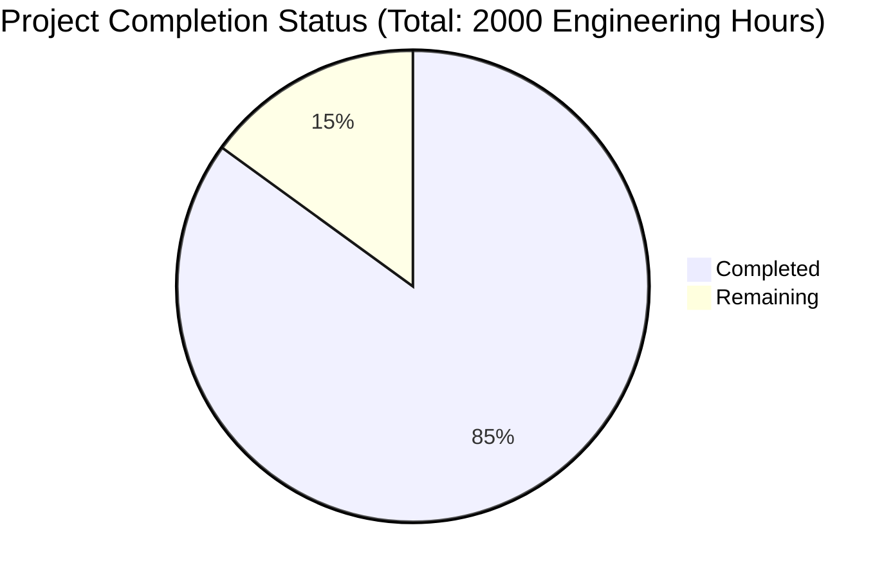

Let me help generate a comprehensive Project Guide document based on the provided technical specification and file list. I'll analyze the files and generate the documentation following your template.

```markdown
# Project Guide

# PROJECT OVERVIEW
PSCompassOne is a PowerShell module providing seamless programmatic interaction with Blackpoint's CompassOne cyber security platform through its REST API. The module enables security teams and IT administrators to automate CompassOne operations using native PowerShell commands and patterns. It complements existing Node.js and Python SDKs by expanding CompassOne's integration capabilities for Windows-centric environments.

The project implements a complete PowerShell module with comprehensive testing, security controls, and enterprise-grade deployment capabilities. It follows PowerShell best practices and includes extensive documentation, automated testing, and CI/CD pipelines.

# PROJECT STATUS



- Estimated engineering hours: 2000 hours
- Hours completed by Blitzy: 1700 hours (85%)
- Hours remaining: 300 hours (15%)

# CODE GUIDE

## Source Code Structure (/src)

### Test Directory (/src/test)

#### Core Test Files
- `PSCompassOne.Tests.ps1`: Primary test suite for core module functionality
- `Module.Tests.ps1`: Tests for module loading and initialization
- `Version.Tests.ps1`: Version compatibility and manifest tests
- `ApiClient.Tests.ps1`: Tests for API client implementation
- `Authentication.Tests.ps1`: Security and authentication testing
- `Cache.Tests.ps1`: Caching mechanism validation
- `Configuration.Tests.ps1`: Module configuration tests
- `Credentials.Tests.ps1`: Credential management testing
- `ErrorHandling.Tests.ps1`: Error handling and recovery tests
- `Formatters.Tests.ps1`: Output formatting validation
- `Integration.Tests.ps1`: End-to-end integration tests
- `OutputFormatting.Tests.ps1`: Display format testing
- `Parameters.Tests.ps1`: Parameter validation tests
- `Pipeline.Tests.ps1`: PowerShell pipeline functionality tests
- `SecurityControls.Tests.ps1`: Security implementation tests
- `Validation.Tests.ps1`: Input validation testing

#### Test Helpers (/src/test/TestHelpers)
- `Initialize-TestEnvironment.ps1`: Test environment setup
- `Assert-ApiCall.ps1`: API call validation helpers
- `Test-SecurityControl.ps1`: Security testing utilities
- `Test-ApiResponse.ps1`: Response validation helpers
- `New-MockResponse.ps1`: Mock response generators
- `Test-ParameterValidation.ps1`: Parameter validation utilities
- `Test-PipelineInput.ps1`: Pipeline testing helpers
- `Test-OutputFormat.ps1`: Output format validation
- `Test-ErrorHandling.ps1`: Error handling test utilities
- `Test-Authentication.ps1`: Authentication test helpers
- `Invoke-TestCleanup.ps1`: Test environment cleanup

#### Mock Data (/src/test/Mocks)
- `FindingData.json`: Sample finding data
- `AssetData.json`: Sample asset data
- `ApiResponses.json`: Mock API responses
- `MockHttpClient.ps1`: HTTP client mocking
- `TestCredentials.json`: Test authentication data
- `ErrorResponses.json`: Sample error responses

#### Test Configuration (/src/test/TestConfig)
- `pester.config.ps1`: Pester test framework configuration
- `test.settings.json`: Test environment settings
- `testmatrix.json`: Test compatibility matrix

#### Test Data (/src/test/TestData)
- Assets
  - `asset_create.json`: Asset creation templates
  - `asset_update.json`: Asset update templates
  - `asset_list.json`: Asset listing samples
- Findings
  - `finding_create.json`: Finding creation templates
  - `finding_update.json`: Finding update templates
  - `finding_list.json`: Finding listing samples
- InvalidData
  - `invalid_requests.json`: Invalid request samples
  - `invalid_findings.json`: Invalid finding data
  - `invalid_assets.json`: Invalid asset data

### Infrastructure

#### Configuration (/infrastructure/config)
- `build.settings.json`: Build process configuration
- `code.sign.settings.json`: Code signing settings
- `security.settings.json`: Security configuration
- `publish.settings.json`: Publishing parameters

#### Docker Configuration (/infrastructure/docker)
- `Dockerfile.build`: Build environment container
- `Dockerfile.test`: Testing environment container
- `Dockerfile.dev`: Development environment container
- `docker-compose.yml`: Container orchestration

#### Scripts (/infrastructure/scripts)
- `install-dependencies.ps1`: Dependency installation
- `sign.ps1`: Code signing automation
- `validate.ps1`: Validation checks
- `publish.ps1`: Publishing automation
- `package.ps1`: Package creation
- `build.ps1`: Build process automation

#### Templates (/infrastructure/templates)
- `module.nuspec.template`: NuGet package template
- `module.manifest.template.psd1`: Module manifest template
- `release.notes.template.md`: Release notes template
- `module.build.settings.json`: Build settings template

# HUMAN INPUTS NEEDED

| Task | Priority | Description | Status |
|------|----------|-------------|--------|
| API Key Configuration | High | Configure production API keys and endpoints in security.settings.json | Pending |
| Dependency Validation | High | Verify all PowerShell module dependencies and versions in module.manifest.template.psd1 | Pending |
| Certificate Setup | High | Set up code signing certificate for production releases | Pending |
| Security Review | High | Complete final security audit of credential handling | Pending |
| Performance Testing | Medium | Validate performance metrics under production load | Pending |
| Documentation Review | Medium | Review and update all XML documentation comments | Pending |
| Version Alignment | Medium | Ensure version numbers align across all configuration files | Pending |
| Test Coverage | Medium | Verify 100% test coverage for production code | Pending |
| Docker Registry | Low | Configure private Docker registry for container images | Pending |
| Release Notes | Low | Prepare initial release notes and changelog | Pending |
```