# Technical Specifications

## 1. INTRODUCTION

### 1.1 EXECUTIVE SUMMARY

PSCompassOne is a PowerShell module that enables seamless programmatic interaction with Blackpoint's CompassOne cyber security platform through its REST API. The module addresses the need for native PowerShell integration capabilities, allowing security teams and IT administrators to automate CompassOne operations using familiar PowerShell commands and patterns. This solution complements existing Node.js and Python SDKs, expanding CompassOne's integration options to better serve Windows-centric environments and PowerShell practitioners.

The module will significantly reduce implementation time and complexity for organizations leveraging PowerShell automation, while ensuring consistent interaction patterns and best practices when working with the CompassOne API.

### 1.2 SYSTEM OVERVIEW

#### Project Context

| Aspect | Description |
|--------|-------------|
| Business Context | Part of Blackpoint's strategy to expand CompassOne platform accessibility and integration options |
| Market Position | Fills gap in Windows automation ecosystem alongside existing Node.js and Python solutions |
| Current Limitations | PowerShell users must currently build custom API integration logic |
| Enterprise Integration | Complements existing security and IT automation workflows in Windows environments |

#### High-Level Description

The PSCompassOne module provides:

- Native PowerShell commands for all CompassOne API operations
- Secure credential management through Microsoft.PowerShell.SecretStore
- Support for all CRAFT service objects (assets, findings, incidents, relationships, tags)
- Standardized input/output formatting and error handling
- Comprehensive PowerShell help documentation

Key architectural decisions:

- PowerShell-native implementation following platform conventions
- REST API client architecture with JSON handling
- Secure credential storage integration
- Support for both PowerShell 5.1 and 7.x

#### Success Criteria

| Category | Metrics |
|----------|---------|
| Performance | - Command execution < 2s for single operations<br>- Batch processing >= 50 items/second<br>- Module startup < 1s |
| Quality | - 100% unit test coverage<br>- Zero security vulnerabilities<br>- Full PowerShell best practices compliance |
| Adoption | - Published to PowerShell Gallery<br>- Documentation completeness<br>- User satisfaction metrics |

### 1.3 SCOPE

#### In-Scope

Core Features:
- Complete CRUD operations for all CRAFT service objects
- Authentication and configuration management
- Output formatting and pretty-printing
- Error handling and validation
- Help documentation and examples

Implementation Boundaries:
- PowerShell 5.1 and 7.x compatibility
- Windows and cross-platform support
- Standard PowerShell module distribution channels
- Core CompassOne API functionality coverage

#### Out-of-Scope

- Custom API endpoint implementations
- Backend API modifications
- GUI/form-based interfaces
- Direct database access
- Custom authentication providers
- Real-time data streaming
- Legacy PowerShell version support
- Custom output formatting templates
- Third-party integration modules

## 2. SYSTEM ARCHITECTURE

### 2.1 High-Level Architecture

The PSCompassOne module follows a layered architecture pattern optimized for PowerShell module development and REST API integration.

```mermaid
C4Context
    title System Context Diagram - PSCompassOne

    Person(user, "PowerShell User", "Security/IT Admin")
    System(pscompassone, "PSCompassOne Module", "PowerShell Module for CompassOne Integration")
    System_Ext(compassone, "CompassOne Platform", "Security Management Platform")
    System_Ext(secretstore, "PowerShell SecretStore", "Credential Management")
    
    Rel(user, pscompassone, "Executes commands")
    Rel(pscompassone, compassone, "Makes API calls", "HTTPS")
    Rel(pscompassone, secretstore, "Stores/retrieves credentials")
    
    UpdateLayoutConfig($c4ShapeInRow=3, $c4BoundaryInRow=2)
```

```mermaid
C4Container
    title Container Diagram - PSCompassOne Module Structure

    Container(cmdlets, "PowerShell Cmdlets", "PowerShell", "Command interface layer")
    Container(core, "Core Services", "PowerShell", "Business logic and operations")
    Container(api, "API Client", "PowerShell", "REST API communication")
    Container(models, "Data Models", "PowerShell Classes", "Object definitions")
    Container(formatters, "Output Formatters", "PowerShell", "Response formatting")
    ContainerDb(cache, "In-Memory Cache", "PowerShell", "Temporary data storage")
    
    Rel(cmdlets, core, "Uses")
    Rel(core, api, "Calls")
    Rel(core, models, "Uses")
    Rel(api, models, "Serializes/Deserializes")
    Rel(core, formatters, "Formats output")
    Rel(core, cache, "Stores/retrieves")

    UpdateLayoutConfig($c4ShapeInRow=3)
```

### 2.2 Component Details

#### 2.2.1 Core Components

| Component | Purpose | Technologies | Interfaces |
|-----------|---------|--------------|------------|
| Command Layer | Exposes PowerShell cmdlets | PowerShell Cmdlets | Public cmdlet interfaces |
| Core Services | Business logic implementation | PowerShell Scripts | Internal function APIs |
| API Client | REST API communication | PowerShell HttpClient | REST endpoints |
| Data Models | Object definitions and validation | PowerShell Classes | Object methods |
| Output Formatters | Response formatting | PowerShell Format XML | Formatting templates |
| Cache Manager | Temporary data storage | PowerShell Collections | Cache interface |

```mermaid
C4Component
    title Component Diagram - Core Services Detail

    Component(auth, "Authentication Service", "Handles credential management")
    Component(validation, "Validation Service", "Input/schema validation")
    Component(http, "HTTP Client", "API communication")
    Component(cache, "Cache Manager", "Data caching")
    Component(format, "Format Manager", "Output formatting")
    Component(error, "Error Handler", "Error management")
    
    Rel(auth, http, "Provides credentials")
    Rel(validation, http, "Validates requests")
    Rel(http, cache, "Caches responses")
    Rel(http, format, "Formats responses")
    Rel(http, error, "Handles errors")

    UpdateLayoutConfig($c4ShapeInRow=3)
```

### 2.3 Technical Decisions

#### 2.3.1 Architecture Patterns

| Pattern | Justification |
|---------|---------------|
| Layered Architecture | Clear separation of concerns, maintainability |
| Command Pattern | PowerShell cmdlet implementation best practice |
| Repository Pattern | Consistent API data access |
| Factory Pattern | Dynamic object creation for different asset types |

#### 2.3.2 Data Flow Architecture

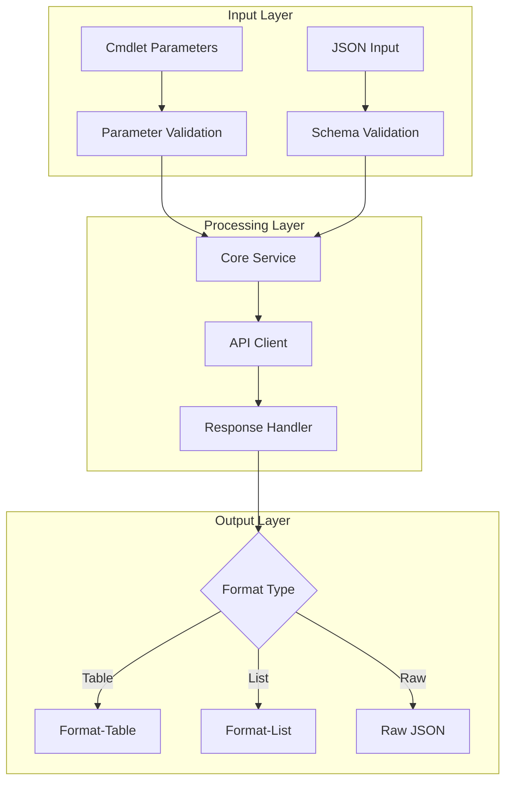

### 2.4 Cross-Cutting Concerns

#### 2.4.1 Observability Architecture

```mermaid
C4Deployment
    title Deployment and Monitoring Architecture

    Deployment_Node(host, "Host System", "Windows/Linux"){
        Deployment_Node(ps, "PowerShell Runtime"){
            Container(module, "PSCompassOne Module")
            Container(logging, "PowerShell Logging")
            Container(tracing, "Debug Tracing")
        }
    }
    
    Deployment_Node(ext, "External Systems"){
        Container(api, "CompassOne API")
        Container(store, "SecretStore")
    }
    
    Rel(module, logging, "Writes logs")
    Rel(module, tracing, "Debug info")
    Rel(module, api, "API calls")
    Rel(module, store, "Credential storage")

    UpdateLayoutConfig($c4ShapeInRow=2)
```

#### 2.4.2 Security Architecture

| Security Layer | Implementation |
|----------------|----------------|
| Authentication | API token management via SecretStore |
| Transport | HTTPS with TLS 1.2+ |
| Input Validation | Parameter and schema validation |
| Credential Protection | Secure string handling |
| Audit Logging | PowerShell event logging |

### 2.5 Integration Architecture

```mermaid
graph TB
    subgraph PSCompassOne Module
        A[Cmdlets] --> B[Core Services]
        B --> C[API Client]
    end
    
    subgraph External Systems
        D[CompassOne API]
        E[SecretStore]
        F[PowerShell Gallery]
    end
    
    C -->|HTTPS| D
    B -->|Credential Storage| E
    PSCompassOne Module -->|Distribution| F
    
    style PSCompassOne Module fill:#f9f,stroke:#333,stroke-width:2px
    style External Systems fill:#bbf,stroke:#333,stroke-width:2px
```

## 3. SYSTEM COMPONENTS ARCHITECTURE

### 3.1 Command-Line Interface Design

#### 3.1.1 Command Structure

| Component | Pattern | Example |
|-----------|---------|---------|
| Command Names | `Verb-CraftNoun` | `Get-CraftAsset`, `New-CraftIncident` |
| Parameters | `-PascalCase` | `-AssetId`, `-PrettyPrint` |
| Switches | `-BooleanFlag` | `-Force`, `-Detailed` |
| Pipeline Support | `ValueFromPipeline` | `Get-CraftAsset \| Set-CraftAssetTag` |

#### 3.1.2 Input/Output Specifications

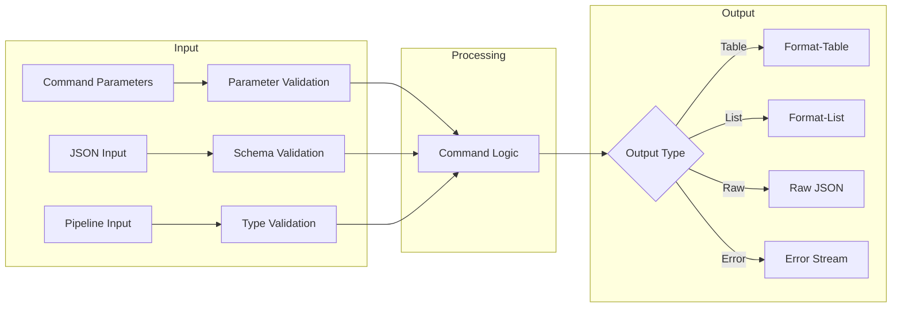

#### 3.1.3 Help System Design

| Component | Implementation |
|-----------|---------------|
| Command Help | Full Get-Help documentation |
| Examples | Practical use cases with code |
| Parameter Help | Detailed parameter descriptions |
| Online Help | Links to web documentation |
| Dynamic Help | Parameter validation messages |

### 3.2 Data Management Design

#### 3.2.1 Cache Architecture

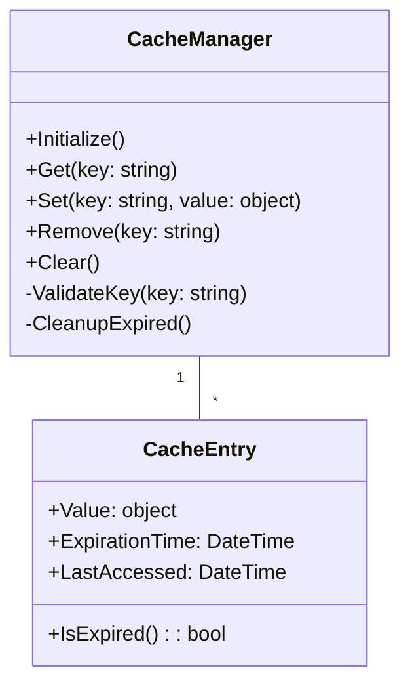

#### 3.2.2 Configuration Storage

| Storage Type | Purpose | Implementation |
|--------------|---------|----------------|
| SecretStore | Credentials | Microsoft.PowerShell.SecretStore |
| Environment | Runtime Config | System Environment Variables |
| Memory Cache | Session Data | In-Memory Dictionary |
| Session State | Temporary Data | PowerShell SessionState |

#### 3.2.3 Data Models

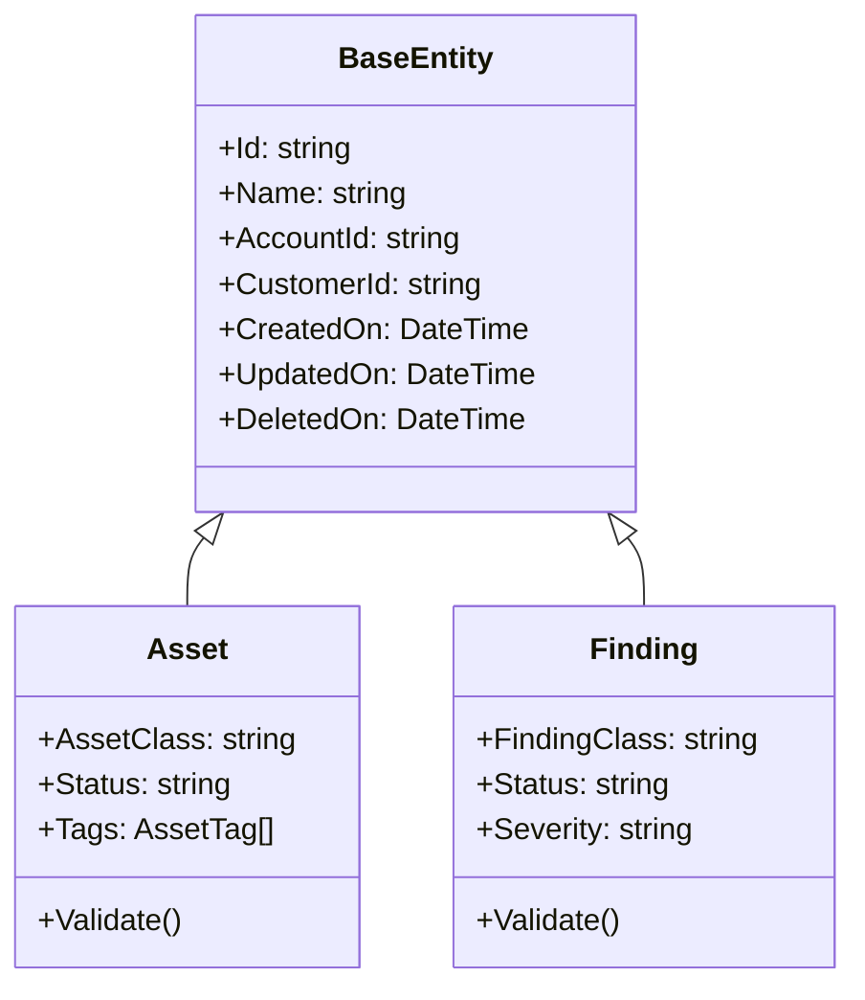

### 3.3 API Integration Design

#### 3.3.1 API Client Architecture

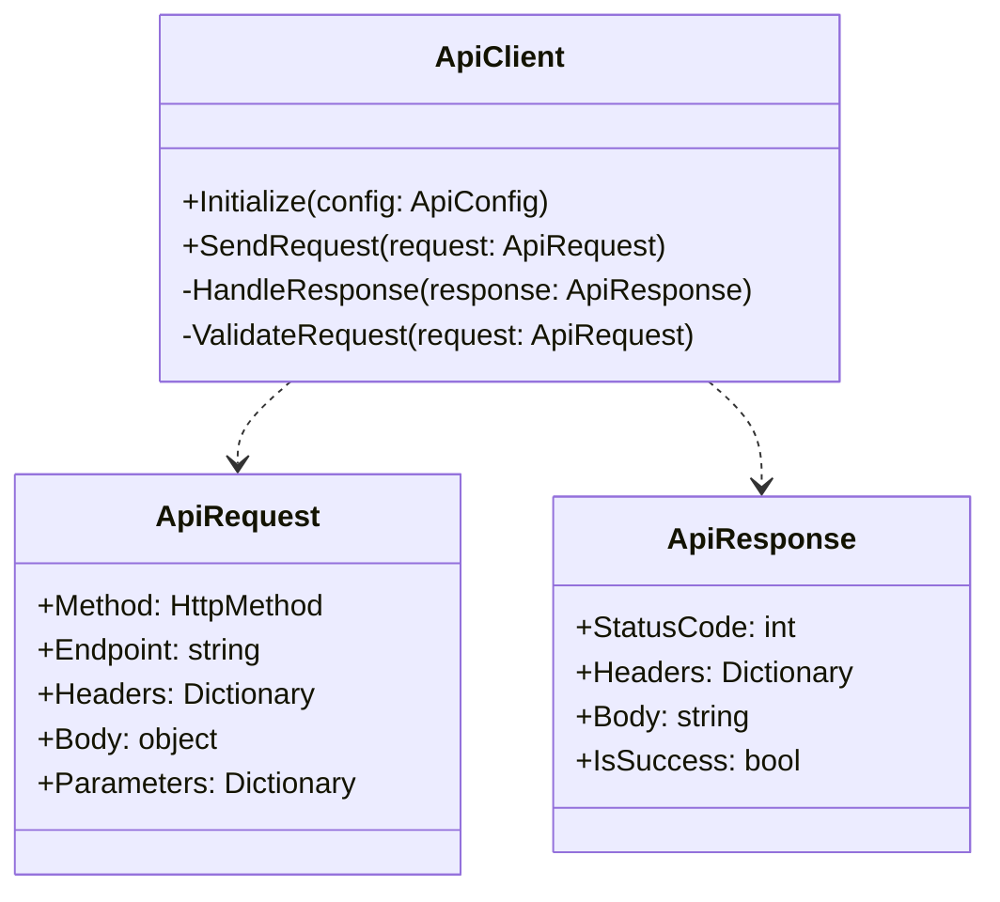

#### 3.3.2 Authentication Flow

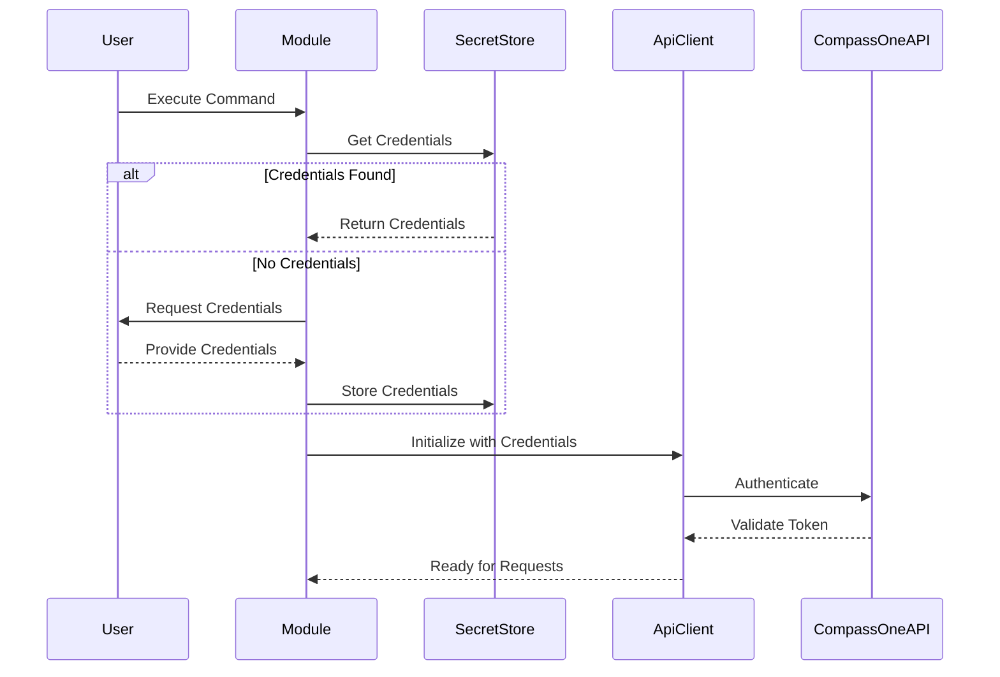

#### 3.3.3 API Integration Specifications

| Component | Specification |
|-----------|---------------|
| Protocol | HTTPS with TLS 1.2+ |
| Authentication | API Key in Header |
| Content Type | application/json |
| Rate Limiting | Exponential backoff |
| Timeout | 30 seconds default |
| Retry Logic | 3 attempts with delay |

### 3.4 Error Handling Design

#### 3.4.1 Error Hierarchy

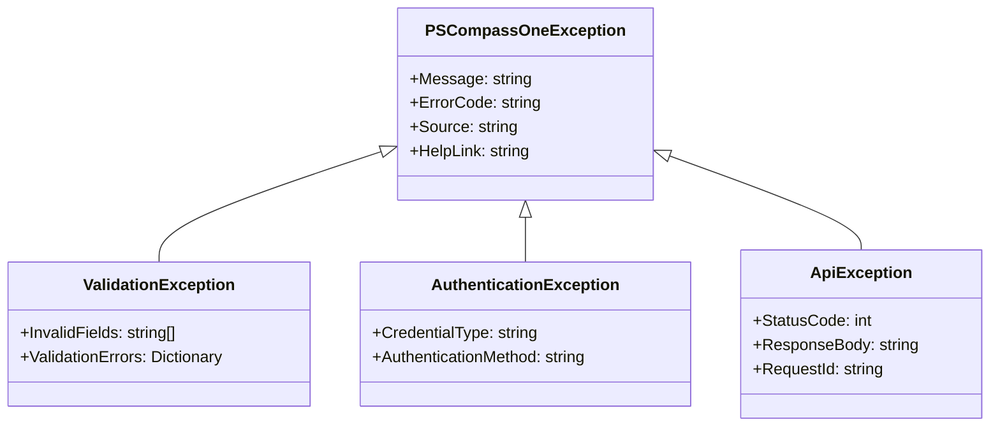

#### 3.4.2 Error Handling Strategy

| Error Type | Handling Approach | User Feedback |
|------------|------------------|---------------|
| Validation | Pre-request check | Specific field errors |
| Authentication | Credential refresh | Auth renewal prompt |
| Network | Retry with backoff | Connection status |
| API | Response parsing | Error code translation |
| System | Graceful degradation | Recovery steps |

### 3.5 Module Organization

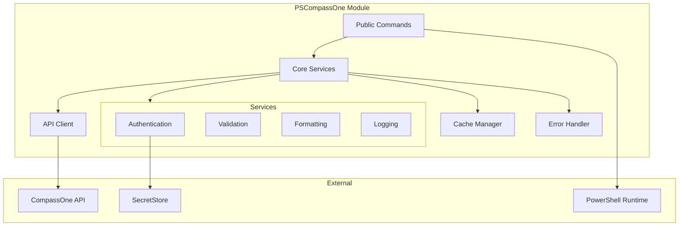

## 4. TECHNOLOGY STACK

### 4.1 PROGRAMMING LANGUAGES

| Language | Usage | Justification | Version |
|----------|--------|---------------|----------|
| PowerShell | Core Module Implementation | - Native PowerShell module development<br>- Cross-platform support<br>- Direct access to PowerShell APIs | 5.1, 7.x |
| C# | Performance-Critical Components | - Enhanced performance for data processing<br>- Strong typing and compile-time checks<br>- PowerShell binary module support | .NET 6.0+ |

### 4.2 FRAMEWORKS & LIBRARIES

#### 4.2.1 Core Dependencies

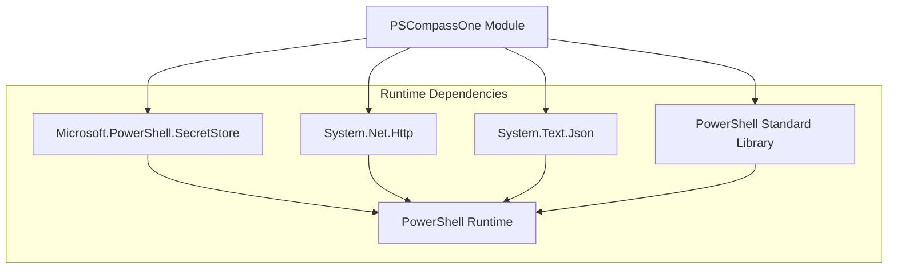

| Framework/Library | Version | Purpose | Justification |
|------------------|---------|---------|---------------|
| Microsoft.PowerShell.SecretStore | 1.0.6+ | Credential Management | - Secure credential storage<br>- PowerShell native integration<br>- Cross-platform support |
| System.Net.Http | 4.3.4+ | API Communication | - Modern HTTP client features<br>- TLS 1.2+ support<br>- Efficient connection pooling |
| System.Text.Json | 6.0.0+ | JSON Processing | - High-performance serialization<br>- Schema validation<br>- Memory efficiency |
| PowerShell Standard Library | 5.1/7.x | Core PowerShell Integration | - PowerShell module development<br>- Cross-version compatibility<br>- Standard cmdlet patterns |

### 4.3 DATABASES & STORAGE

#### 4.3.1 Storage Architecture

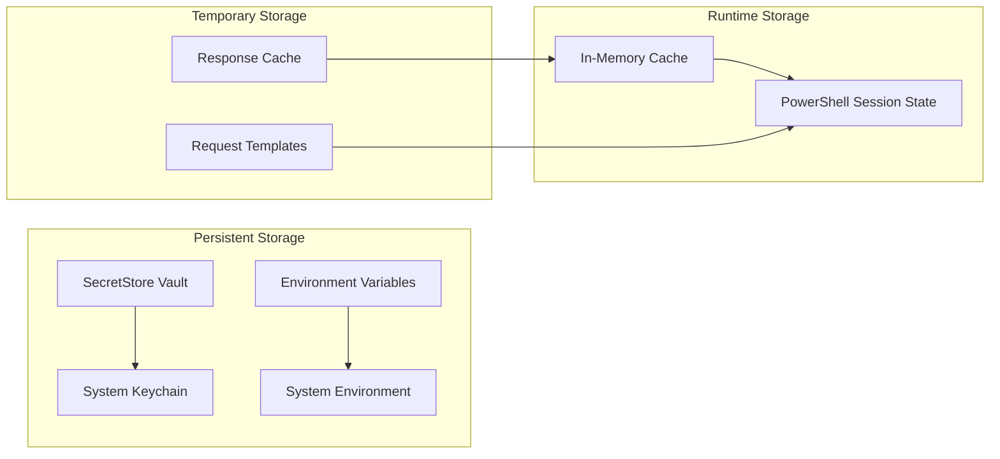

| Storage Type | Implementation | Purpose | Justification |
|--------------|----------------|---------|---------------|
| Credential Storage | SecretStore | API credentials | - Secure encryption<br>- PowerShell native<br>- Cross-platform |
| Runtime Cache | Dictionary | Response caching | - Performance optimization<br>- Memory efficient<br>- Thread-safe |
| Session State | PowerShell | Command state | - Native PowerShell storage<br>- Scope isolation<br>- Automatic cleanup |

### 4.4 THIRD-PARTY SERVICES

#### 4.4.1 Service Integration Architecture

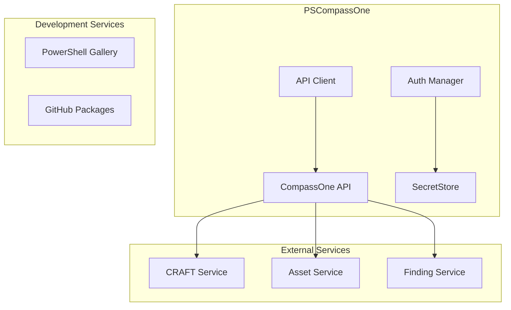

| Service | Purpose | Integration Method |
|---------|---------|-------------------|
| CompassOne API | Core Platform Integration | REST API over HTTPS |
| PowerShell Gallery | Module Distribution | PowerShell publishing tools |
| GitHub | Source Control & CI/CD | Git & GitHub Actions |

### 4.5 DEVELOPMENT & DEPLOYMENT

#### 4.5.1 Development Pipeline

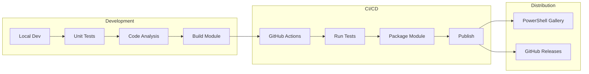

| Tool | Version | Purpose | Justification |
|------|---------|---------|---------------|
| PSScriptAnalyzer | 1.20+ | Code Quality | - PowerShell best practices<br>- Style consistency<br>- Security checks |
| Pester | 5.3+ | Testing Framework | - PowerShell native testing<br>- Mocking support<br>- Code coverage |
| platyPS | 2.0+ | Documentation | - PowerShell help generation<br>- Markdown support<br>- MAML conversion |
| GitHub Actions | N/A | CI/CD Pipeline | - Automated builds<br>- Test execution<br>- Gallery publishing |

### 5. SYSTEM DESIGN

#### 5.1 Command-Line Interface Design

The PSCompassOne module follows PowerShell command-line interface conventions with the following command structure:

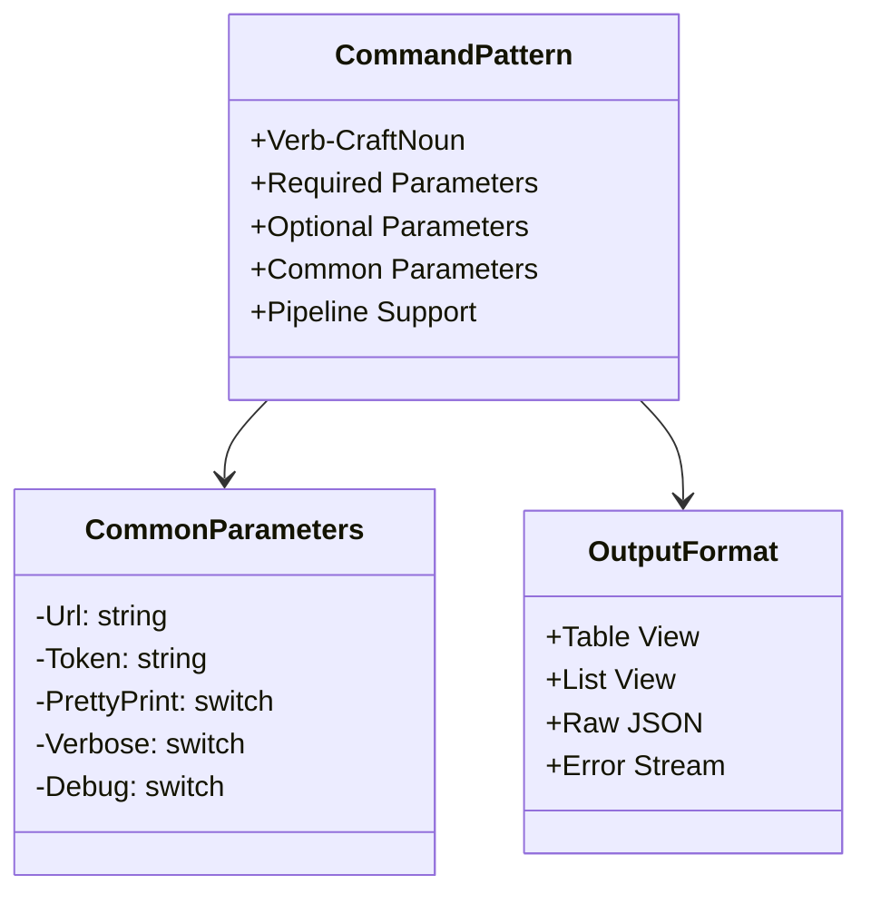

##### 5.1.1 Command Structure Examples

| Command Type | Pattern | Example |
|--------------|---------|----------|
| Get Single | `Get-Craft<Entity> -Id <string>` | `Get-CraftAsset -Id "abc123"` |
| List | `Get-Craft<Entity>List [-PageSize <int>] [-Page <int>]` | `Get-CraftAssetList -PageSize 50` |
| Create | `New-Craft<Entity> -JsonBody <string>` | `New-CraftAsset -JsonBody $json` |
| Update | `Set-Craft<Entity> -Id <string> -JsonBody <string>` | `Set-CraftAsset -Id "abc123" -JsonBody $json` |
| Delete | `Remove-Craft<Entity> -Id <string>` | `Remove-CraftAsset -Id "abc123"` |

#### 5.2 Module Architecture

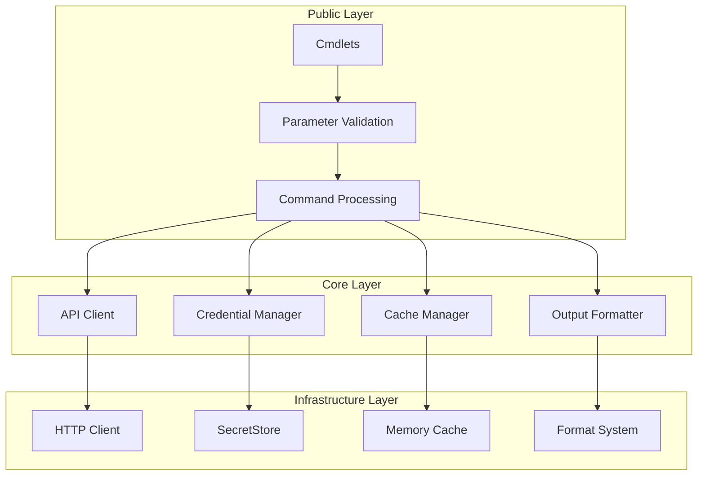

#### 5.3 Data Flow Architecture

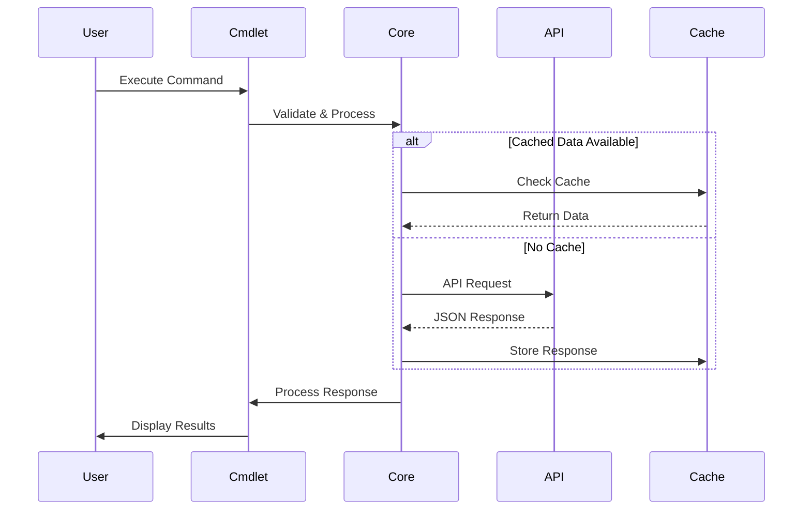

#### 5.4 Component Architecture

##### 5.4.1 Core Components

| Component | Purpose | Implementation |
|-----------|---------|----------------|
| Command Layer | Public interface | PowerShell Cmdlets |
| Parameter Validation | Input validation | Parameter Attributes |
| API Client | REST communication | HttpClient |
| Credential Manager | Auth handling | SecretStore Integration |
| Cache Manager | Response caching | In-Memory Dictionary |
| Output Formatter | Response formatting | Format.ps1xml |

##### 5.4.2 Component Interactions

```mermaid
classDiagram
    class CmdletBase {
        +ProcessRecord()
        +BeginProcessing()
        +EndProcessing()
        #ValidateParameters()
    }
    
    class ApiClient {
        +SendRequest()
        +HandleResponse()
        -ValidateRequest()
        -ProcessError()
    }
    
    class CredentialManager {
        +GetCredentials()
        +StoreCredentials()
        +ValidateCredentials()
        -EncryptCredentials()
    }
    
    class OutputFormatter {
        +FormatResponse()
        +PrettyPrint()
        +ConvertToTable()
        -ValidateFormat()
    }
    
    CmdletBase --> ApiClient
    CmdletBase --> CredentialManager
    CmdletBase --> OutputFormatter
```

#### 5.5 Error Handling Design

```mermaid
flowchart TD
    A[Error Occurs] --> B{Error Type}
    
    B -->|Validation| C[Parameter Validation]
    B -->|API| D[API Error]
    B -->|Network| E[Network Error]
    B -->|Auth| F[Auth Error]
    
    C --> G[Format Error Message]
    D --> G
    E --> G
    F --> G
    
    G --> H{Error Level}
    H -->|Warning| I[Write-Warning]
    H -->|Error| J[Write-Error]
    H -->|Terminating| K[ThrowTerminating]
```

#### 5.6 API Integration Design

##### 5.6.1 Request/Response Flow

```mermaid
sequenceDiagram
    participant Cmdlet
    participant RequestBuilder
    participant ApiClient
    participant ResponseHandler
    participant CompassOneAPI
    
    Cmdlet->>RequestBuilder: Build Request
    RequestBuilder->>ApiClient: Send Request
    ApiClient->>CompassOneAPI: HTTP Request
    CompassOneAPI-->>ApiClient: HTTP Response
    ApiClient->>ResponseHandler: Process Response
    ResponseHandler-->>Cmdlet: Return Result
```

##### 5.6.2 API Endpoint Mapping

| PowerShell Command | HTTP Method | Endpoint | Description |
|-------------------|-------------|----------|-------------|
| Get-CraftAsset | GET | /v1/assets/{id} | Get single asset |
| Get-CraftAssetList | GET | /v1/assets | List assets |
| New-CraftAsset | POST | /v1/assets | Create asset |
| Set-CraftAsset | PATCH | /v1/assets/{id} | Update asset |
| Remove-CraftAsset | DELETE | /v1/assets/{id} | Delete asset |

#### 5.7 Security Design

```mermaid
graph TB
    subgraph Security Components
        A[Credential Management] --> B[SecretStore]
        C[Request Security] --> D[HTTPS Transport]
        E[Input Validation] --> F[Schema Validation]
        G[Error Handling] --> H[Error Masking]
    end
    
    subgraph Security Flow
        I[User Input] --> E
        E --> C
        C --> J[API Request]
        J --> K[Response]
        K --> G
    end
```

##### 5.7.1 Security Controls

| Control | Implementation | Purpose |
|---------|----------------|----------|
| Authentication | SecretStore/Headers | Secure API access |
| Transport | HTTPS/TLS 1.2+ | Secure communication |
| Input Validation | Parameter/Schema | Prevent injection |
| Error Handling | Masked Messages | Prevent info disclosure |
| Credential Storage | Encrypted Store | Protect secrets |

## 6. USER INTERFACE DESIGN

### 6.1 Command-Line Interface Components

The PSCompassOne module provides a PowerShell command-line interface following standard PowerShell conventions. Below are the key interface patterns and components:

#### 6.1.1 Help Interface

```
+----------------------------------------------------------+
|                    Get-Help Get-CraftAsset                 |
+----------------------------------------------------------+
| NAME                                                       |
|     Get-CraftAsset                                        |
|                                                           |
| SYNOPSIS                                                  |
|     [i] Gets a CompassOne asset by ID or lists assets     |
|                                                           |
| SYNTAX                                                    |
|     Get-CraftAsset [-Id] <string> [-PrettyPrint]         |
|     [-Url <string>] [-Token <string>]                     |
|                                                           |
| PARAMETERS                                                |
|     -Id <string>                                         |
|         [?] The unique identifier of the asset            |
|                                                           |
|     -PrettyPrint [<switch>]                              |
|         [i] Format output as table/indented JSON          |
+----------------------------------------------------------+
| [?] For detailed help: Get-Help Get-CraftAsset -Full      |
+----------------------------------------------------------+
```

#### 6.1.2 Asset List Output

```
+----------------------------------------------------------+
|                    Get-CraftAssetList                      |
+----------------------------------------------------------+
| ID          Name         Type      Status    Last Seen     |
|----------------------------------------------------------|
| abc123      WebServer    DEVICE    Active    2024-01-20    |
| def456      Container01  CONTAINER Running   2024-01-20    |
| ghi789      LinuxHost    DEVICE    Active    2024-01-20    |
|                                                           |
| [<] Prev  Page 1 of 5 [>]    Items: 50    Total: 243     |
+----------------------------------------------------------+
| Options: [-PageSize 50] [-Page 1] [-SortBy name]          |
+----------------------------------------------------------+
```

#### 6.1.3 Asset Detail View (Pretty Print)

```
+----------------------------------------------------------+
|                    Get-CraftAsset -Id abc123               |
+----------------------------------------------------------+
| Asset Details:                                            |
| +--------------------------------------------------------|
| | ID:          abc123                                     |
| | Name:        WebServer                                  |
| | Type:        DEVICE                                     |
| | Status:      Active                                     |
| | Created:     2024-01-01T10:00:00Z                      |
| | Last Seen:   2024-01-20T15:30:00Z                      |
| |                                                         |
| | [*] Tags:                                              |
| | +-- Production                                         |
| | +-- WebServer                                          |
| | +-- Critical                                           |
| |                                                         |
| | [i] Properties:                                        |
| | +-- OS: Windows Server 2019                            |
| | +-- IP: 192.168.1.100                                  |
| | +-- Location: US-East                                  |
+----------------------------------------------------------+
```

#### 6.1.4 Create Asset Interface

```
+----------------------------------------------------------+
|                    New-CraftAsset                          |
+----------------------------------------------------------+
| Required JSON Input:                                      |
| {                                                         |
|   "asset": {                                             |
|     "assetClass": "DEVICE",                              |
|     "name": "NewServer",                                 |
|     "accountId": "acc123",                               |
|     "customerId": "cust456"                              |
|   }                                                      |
| }                                                        |
|                                                          |
| [^] Input Methods:                                       |
| ( ) Pipeline Input                                       |
| ( ) JSON File Path                                       |
| (•) Direct JSON String                                   |
+----------------------------------------------------------+
| [!] Validation Status: [...........................] 0%   |
+----------------------------------------------------------+
```

#### 6.1.5 Configuration Interface

```
+----------------------------------------------------------+
|                    Set-CraftConfiguration                  |
+----------------------------------------------------------+
| Authentication Method:                                    |
| ( ) Command Line Parameters                              |
|     [-Url <string>] [-Token <string>]                    |
|                                                          |
| ( ) Environment Variables                                |
|     $env:COMPASSONE_API_URL                              |
|     $env:COMPASSONE_API_TOKEN                            |
|                                                          |
| (•) SecretStore [Recommended]                            |
|     [Save to SecretStore] [Clear SecretStore]            |
+----------------------------------------------------------+
| [=] Current Configuration:                                |
| URL:   https://api.compassone.com                        |
| Token: ●●●●●●●●●●●●●●●●                                 |
+----------------------------------------------------------+
```

### 6.2 Interface Component Key

```
Symbol Key:
[?] - Help/Documentation available
[i] - Information/Details
[+] - Add/Create new item
[x] - Close/Delete/Remove
[<] [>] - Navigation/Pagination
[^] - Input/Upload
[#] - Dashboard/Overview
[@] - User/Account information
[!] - Warning/Error message
[=] - Settings/Configuration
[*] - Important/Featured items
[v] - Dropdown menu

Input Components:
[ ] - Checkbox (unchecked)
[x] - Checkbox (checked)
( ) - Radio button (unselected)
(•) - Radio button (selected)
[...] - Text input field
[Button] - Clickable button
[====] - Progress/Status bar
```

### 6.3 Interface Guidelines

1. Command Naming:
   - Use Verb-CraftNoun pattern
   - Standard verbs: Get, New, Set, Remove
   - Consistent noun prefixes: Craft

2. Parameter Standards:
   - Required parameters in position 1
   - Optional parameters with clear names
   - Common parameters across commands
   - Support for pipeline input

3. Output Formatting:
   - Consistent table headers
   - Aligned columns
   - Clear hierarchy in detailed views
   - Pretty print option for all outputs

4. Error Display:
   - Clear error messages
   - Validation status indicators
   - Progress feedback for long operations
   - Warning indicators for destructive actions

5. Help Integration:
   - Comprehensive Get-Help documentation
   - Examples for all commands
   - Parameter descriptions
   - Related command references

### 7. SECURITY CONSIDERATIONS

#### 7.1 AUTHENTICATION AND AUTHORIZATION

```mermaid
flowchart TD
    A[Authentication Request] --> B{Auth Method}
    B -->|Command Line| C[Token via Parameters]
    B -->|Environment| D[Token via Env Vars]
    B -->|SecretStore| E[Token via SecretStore]
    
    C --> F[Token Validation]
    D --> F
    E --> F
    
    F --> G{Valid?}
    G -->|No| H[Error Response]
    G -->|Yes| I[Create API Client]
    
    I --> J[Request Authorization]
    J --> K{API Response}
    K -->|Success| L[Cache Token]
    K -->|Failure| M[Clear Token]
```

| Security Control | Implementation | Purpose |
|-----------------|----------------|----------|
| Token Management | Microsoft.PowerShell.SecretStore | Secure storage of API credentials |
| Token Validation | Pre-request validation | Prevent unauthorized API access |
| Session Management | In-memory token caching | Optimize performance while maintaining security |
| Authorization Checks | API response validation | Ensure proper access levels |
| Token Rotation | Automatic token refresh | Maintain security over time |

#### 7.2 DATA SECURITY

```mermaid
classDiagram
    class SecurityManager {
        +ValidateCredentials()
        +EncryptData()
        +DecryptData()
        +SanitizeOutput()
        -SecureString apiToken
        -byte[] encryptionKey
    }
    
    class DataProtection {
        +ProtectSensitiveData()
        +UnprotectSensitiveData()
        +ValidateDataIntegrity()
        -HashAlgorithm hashAlg
    }
    
    SecurityManager --> DataProtection
```

| Data Type | Protection Method | Storage Location |
|-----------|------------------|------------------|
| API Tokens | AES-256 Encryption | SecretStore Vault |
| Request Data | TLS 1.2+ | In Transit Only |
| Response Data | Memory Protection | Runtime Only |
| Cached Data | DPAPI Encryption | Memory Only |
| Audit Logs | Event Log Protection | System Event Log |

#### 7.3 SECURITY PROTOCOLS

```mermaid
sequenceDiagram
    participant User
    participant Module
    participant SecurityLayer
    participant API
    
    User->>Module: Execute Command
    Module->>SecurityLayer: Validate Request
    SecurityLayer->>SecurityLayer: Apply Security Controls
    SecurityLayer->>API: Secure Request
    API-->>SecurityLayer: Encrypted Response
    SecurityLayer->>SecurityLayer: Validate Response
    SecurityLayer-->>Module: Sanitized Data
    Module-->>User: Safe Output
```

| Protocol | Standard | Implementation |
|----------|----------|----------------|
| Transport Security | TLS 1.2+ | System.Net.Http.HttpClient |
| Data Encryption | AES-256 | System.Security.Cryptography |
| Hash Verification | SHA-256 | System.Security.Cryptography |
| Secret Management | DPAPI | Microsoft.PowerShell.SecretStore |
| Input Validation | Schema Validation | PowerShell Parameter Validation |

#### 7.4 SECURITY CONTROLS MATRIX

| Control Category | Control | Implementation | Verification |
|-----------------|---------|-----------------|--------------|
| Access Control | Authentication | API Token Validation | Pre-request check |
| Data Protection | Encryption | TLS 1.2+ | Protocol enforcement |
| Input Validation | Parameter Validation | PowerShell Attributes | Runtime validation |
| Output Security | Data Sanitization | Output formatting | Post-processing |
| Audit | Security Logging | PowerShell Event Log | Real-time monitoring |
| Storage Security | Secure Credentials | SecretStore | Encryption at rest |

#### 7.5 SECURITY MONITORING AND LOGGING

```mermaid
graph TB
    subgraph Security Events
        A[Command Execution] --> B[Security Log]
        C[Authentication] --> B
        D[API Errors] --> B
        E[Access Violations] --> B
    end
    
    subgraph Monitoring
        B --> F[Event Collection]
        F --> G[Alert Rules]
        G --> H[Security Notifications]
    end
```

| Event Type | Logging Level | Storage Location | Retention |
|------------|--------------|------------------|-----------|
| Authentication | Verbose | Security Event Log | 30 days |
| API Access | Information | Application Log | 30 days |
| Security Violations | Warning | Security Event Log | 90 days |
| System Errors | Error | Application Log | 90 days |
| Audit Events | Information | Security Event Log | 90 days |

#### 7.6 COMPLIANCE REQUIREMENTS

| Requirement | Implementation | Validation |
|------------|----------------|------------|
| Secure Communication | TLS 1.2+ | Protocol verification |
| Data Protection | AES-256 Encryption | Encryption validation |
| Access Control | Token-based Auth | Authentication checks |
| Audit Logging | Event Logging | Log verification |
| Secret Management | SecretStore | Security review |
| Input Validation | Parameter Validation | Testing validation |

## 8. INFRASTRUCTURE

### 8.1 DEPLOYMENT ENVIRONMENT

The PSCompassOne module supports flexible deployment across various environments to accommodate different PowerShell usage scenarios:

| Environment Type | Description | Requirements |
|-----------------|-------------|--------------|
| Local Workstation | Direct installation via PowerShell Gallery | - PowerShell 5.1+ or 7.x<br>- Internet connectivity<br>- SecretStore module |
| Enterprise Deployment | Managed distribution via internal package repositories | - Internal PowerShell repository<br>- Group Policy support<br>- Network access to CompassOne API |
| CI/CD Environment | Automated testing and deployment | - PowerShell test environment<br>- Build agent support<br>- GitHub Actions runners |
| Air-Gapped Systems | Offline installation via downloaded package | - Manual package transfer<br>- Offline module installation<br>- Local documentation |

```mermaid
flowchart TD
    subgraph Deployment Options
        A[PowerShell Gallery] -->|Public Install| B[Local Workstation]
        C[Internal Repository] -->|Enterprise Install| D[Corporate Systems]
        E[Manual Package] -->|Offline Install| F[Air-Gapped Systems]
    end
    
    subgraph Runtime Environment
        B --> G[PowerShell Runtime]
        D --> G
        F --> G
        G --> H[CompassOne API]
    end
```

### 8.2 CLOUD SERVICES

The module leverages the following cloud services for distribution and integration:

| Service | Purpose | Justification |
|---------|---------|---------------|
| PowerShell Gallery | Module distribution | - Standard PowerShell package repository<br>- Automated version management<br>- Public accessibility |
| GitHub Packages | Alternative distribution | - Version control integration<br>- CI/CD pipeline support<br>- Enterprise distribution option |
| Azure DevOps Artifacts | Enterprise repository | - Corporate deployment support<br>- Private package hosting<br>- Integration with enterprise tools |

### 8.3 CONTAINERIZATION

Development and testing environments are containerized to ensure consistency:

```mermaid
graph TB
    subgraph Container Images
        A[Base PowerShell Image] --> B[Dev Container]
        A --> C[Test Container]
        A --> D[Build Container]
    end
    
    subgraph Container Config
        E[Dev Environment] --> B
        F[Test Suite] --> C
        G[Build Tools] --> D
    end
    
    subgraph Volumes
        H[Source Code] --> B
        I[Test Data] --> C
        J[Build Artifacts] --> D
    end
```

| Container Type | Purpose | Configuration |
|---------------|---------|---------------|
| Development | Local development environment | - PowerShell 7.x<br>- Development tools<br>- Live reload support |
| Testing | Automated test execution | - Multiple PowerShell versions<br>- Test frameworks<br>- Code coverage tools |
| Build | Package creation and validation | - Build tools<br>- Package validation<br>- Signing tools |

### 8.4 ORCHESTRATION

While full container orchestration is not required for the module itself, testing infrastructure uses container orchestration:

| Component | Implementation | Purpose |
|-----------|---------------|----------|
| Test Matrix | Docker Compose | Parallel testing across PowerShell versions |
| Version Validation | Container Sets | Compatibility verification |
| Integration Tests | Orchestrated Environments | API interaction testing |

```mermaid
graph TB
    subgraph Test Orchestration
        A[Test Controller] --> B[PS 5.1 Tests]
        A --> C[PS 7.0 Tests]
        A --> D[PS 7.x Tests]
    end
    
    subgraph Results
        B --> E[Test Reports]
        C --> E
        D --> E
        E --> F[Coverage Analysis]
    end
```

### 8.5 CI/CD PIPELINE

The module implements a comprehensive CI/CD pipeline using GitHub Actions:

```mermaid
flowchart TD
    A[Source Code] -->|Push| B[GitHub Repository]
    B -->|Trigger| C[GitHub Actions]
    
    subgraph CI Pipeline
        C -->|Build| D[Build Module]
        D -->|Test| E[Run Tests]
        E -->|Analyze| F[Code Analysis]
        F -->|Package| G[Create Package]
    end
    
    subgraph CD Pipeline
        G -->|Validate| H[Package Validation]
        H -->|Sign| I[Code Signing]
        I -->|Deploy| J[PowerShell Gallery]
        I -->|Deploy| K[GitHub Packages]
    end
    
    subgraph Notifications
        J --> L[Release Notes]
        K --> L
        L --> M[Team Notifications]
    end
```

| Stage | Actions | Tools |
|-------|---------|-------|
| Build | - Code compilation<br>- Resource generation<br>- Documentation building | - PSake<br>- platyPS<br>- VSCode Build Tools |
| Test | - Unit tests<br>- Integration tests<br>- Code coverage | - Pester<br>- PSScriptAnalyzer<br>- Coverage Tools |
| Analyze | - Code quality<br>- Security scanning<br>- Dependency checks | - PSScriptAnalyzer<br>- Security scanners<br>- Dependency trackers |
| Package | - Module bundling<br>- Manifest validation<br>- Version control | - Module bundlers<br>- Manifest tools<br>- Version managers |
| Deploy | - Gallery publishing<br>- Package distribution<br>- Release management | - PowerShellGet<br>- GitHub Actions<br>- Release tools |

The pipeline ensures:
- Automated testing across PowerShell versions
- Consistent code quality and security standards
- Automated package publishing
- Version control and release management
- Documentation updates and distribution

## APPENDICES

### A.1 ADDITIONAL TECHNICAL INFORMATION

#### A.1.1 PowerShell Version Compatibility Matrix

| Feature | PowerShell 5.1 | PowerShell 7.x | Notes |
|---------|---------------|----------------|--------|
| SecretStore Integration | ✓ | ✓ | Requires module installation |
| Async Operations | Limited | Full | Better performance in 7.x |
| Class Support | Basic | Enhanced | Improved inheritance in 7.x |
| Error Handling | Basic | Enhanced | Better stack traces in 7.x |
| Cross-Platform | Windows Only | Full | Linux/macOS support in 7.x |

#### A.1.2 API Response Caching Strategy

```mermaid
flowchart TD
    A[API Request] --> B{Cached?}
    B -->|Yes| C[Check Cache Age]
    B -->|No| D[Make API Call]
    C -->|Valid| E[Return Cached]
    C -->|Expired| D
    D --> F[Cache Response]
    F --> G[Return Fresh]
```

#### A.1.3 Module Load Order Dependencies

```mermaid
graph TD
    A[PSCompassOne.psd1] --> B[PSCompassOne.psm1]
    B --> C[Configuration.ps1]
    B --> D[ApiClient.ps1]
    B --> E[Formatters.ps1]
    C --> F[SecretStore]
    D --> G[System.Net.Http]
    E --> H[Format.ps1xml]
```

### A.2 GLOSSARY

| Term | Definition |
|------|------------|
| Asset Class | Specific type of asset in CompassOne (Device, Container, etc.) |
| CRAFT Service | Core REST API Framework Technology service in CompassOne |
| Finding Class | Category of security finding (Alert, Event, Incident) |
| Format Definition | PowerShell output formatting specification |
| Module Manifest | PowerShell module definition file (.psd1) |
| Pipeline | PowerShell's object-passing mechanism between commands |
| Pretty Print | Formatted output with proper indentation and structure |
| SecretStore | PowerShell's secure credential storage system |
| Session State | PowerShell's runtime state management |

### A.3 ACRONYMS

| Acronym | Definition |
|---------|------------|
| API | Application Programming Interface |
| CRAFT | Core REST API Framework Technology |
| CRUD | Create, Read, Update, Delete |
| FQDN | Fully Qualified Domain Name |
| JSON | JavaScript Object Notation |
| MAML | Microsoft Assistance Markup Language |
| REST | Representational State Transfer |
| SDK | Software Development Kit |
| SOC | Security Operations Center |
| TLS | Transport Layer Security |
| UUID | Universally Unique Identifier |

### A.4 COMMAND NAMING PATTERNS

| Operation Type | Pattern | Example |
|---------------|---------|----------|
| Get Single | Get-Craft{Entity} | Get-CraftAsset |
| List Multiple | Get-Craft{Entity}List | Get-CraftAssetList |
| Create | New-Craft{Entity} | New-CraftAsset |
| Update | Set-Craft{Entity} | Set-CraftAsset |
| Delete | Remove-Craft{Entity} | Remove-CraftAsset |
| Tag Operations | Set-Craft{Entity}Tag | Set-CraftAssetTag |
| Relationship Operations | Get-Craft{Entity}Relationship | Get-CraftAssetRelationship |

### A.5 ERROR CODE MAPPING

| HTTP Status | PowerShell Error Category | Error Action |
|-------------|-------------------------|--------------|
| 400 | InvalidArgument | Non-terminating |
| 401 | SecurityError | Terminating |
| 403 | PermissionDenied | Terminating |
| 404 | ObjectNotFound | Non-terminating |
| 429 | LimitsExceeded | Retry with backoff |
| 500 | InvalidOperation | Terminating |
| 503 | ConnectionError | Retry with backoff |

### A.6 PARAMETER VALIDATION RULES

| Parameter Type | Validation Rule | Example |
|---------------|-----------------|---------|
| Asset ID | UUID format | [ValidatePattern('^[0-9a-fA-F]{8}-([0-9a-fA-F]{4}-){3}[0-9a-fA-F]{12}$')] |
| Page Size | 1-100 range | [ValidateRange(1,100)] |
| Sort Field | Allowed values | [ValidateSet('name','createdOn','status')] |
| JSON Input | Schema validation | Validate-JsonSchema |
| API URL | HTTPS URL format | [ValidatePattern('^https://')] |
| Date Time | ISO 8601 format | [ValidatePattern('^\\d{4}-\\d{2}-\\d{2}T\\d{2}:\\d{2}:\\d{2}Z$')] |